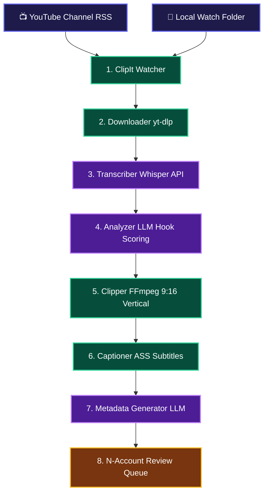

# ✂️ ClipIt — Overview & Product Specifications

> [!NOTE] 🌟 **Core Product Vision**
> **ClipIt** is an autonomous, open-source, self-hosted AI clipping engine designed to turn long-form videos (YouTube, podcasts, streams) into high-retention vertical clips (TikTok, Shorts, Reels) autonomously across **N social media accounts**.

---

## 🔄 End-to-End ClipIt Pipeline

---

## 🛡️ ClipIt Guarantees

> [!SUCCESS] **1. Crash & Reboot Resilience**
> Jobs strictly advance through SQLite states (`PENDING` ➔ `DOWNLOADING` ➔ `TRANSCRIBING` ➔ `ANALYZING` ➔ `CLIPPING` ➔ `CAPTIONING` ➔ `METADATA` ➔ `COMPLETED`). If the phone restarts, background execution resumes from the exact state without duplicating completed work.

> [!TIP] **2. Unlimited Multi-Account Scaling (N Accounts)**
> ClipIt handles 1 to 50+ accounts seamlessly with isolated branding presets, custom LLM prompt tones, and distinct output export queues.

> [!IMPORTANT] **3. Strictly Decoupled Architecture**
> Every module implements `process(job_context)` independently. Speech-to-text engines, LLMs, or video filters can be swapped with zero impact on the rest of the system.

---

## 🔗 Related References
- [[Pipeline-Modules| 🧩 Detailed Module Specs]]
- [[Decisions#ADR-001| ⚖️ ADR-001: Hybrid Cloud AI + Local FFmpeg Strategy]]
- [[Decisions#ADR-002| ⚖️ ADR-002: SQLite Job Queue & State Machine]]
- [[Tasks| 📝 Master Task Board]]
