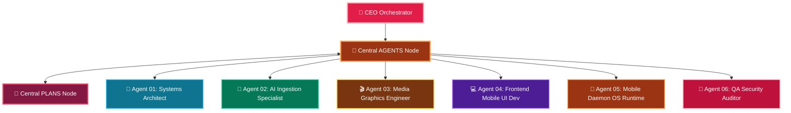

# 🤖 AGENTS — MASTER AUTONOMOUS DIVISION HUB

> [!ABSTRACT] 🌟 **Central Autonomous Agent Division**
> The master hub for all 6 autonomous engineering agents building **ClipIt**, governed by the **[[CEO-Operational-Guide| CEO Orchestrator]]**. Connected directly to **[[PLANS]]**, forming a dedicated dual-hub satellite network.

---

## 👑 CEO Orchestrator Command
- 👑 **[[CEO-Operational-Guide| CEO & Chief Engineering Orchestrator Specification]]**

---

## 🗺️ Master Agent Division Star Topology

---

## 📂 Autonomous Agent Inventory & Color Matrix

> [!IMPORTANT] **Click any agent hub below to view its single hub specification & star cluster:**

| Agent Badge | Agent Hub Node | Dedicated Star Cluster Sub-Nodes | Graph View Color |
| :---: | :--- | :--- | :---: |
| 👑 **CEO** | [[CEO-Operational-Guide]] | Master Control, Directory Mappings & Activation | `🔴 ROSE RED` |
| 🎯 **AGENT 01** | [[Agent-01-Systems-Architect]] | [[Agent-01-Tasks]], [[Agent-01-Architecture]], [[Agent-01-Plan]], [[Agent-01-Overview]], [[Agent-01-Daily-Log]], [[Agent-01-Decisions]], [[Agent-01-Peer-Review]] | `🔷 ELECTRIC CYAN` |
| 🤖 **AGENT 02** | [[Agent-02-AI-Ingestion-Specialist]] | [[Agent-02-Tasks]], [[Agent-02-Architecture]], [[Agent-02-Plan]], [[Agent-02-Overview]], [[Agent-02-Daily-Log]], [[Agent-02-Decisions]], [[Agent-02-Peer-Review]] | `🟢 EMERALD GREEN` |
| 🎬 **AGENT 03** | [[Agent-03-Media-Graphics-Engineer]] | [[Agent-03-Tasks]], [[Agent-03-Architecture]], [[Agent-03-Plan]], [[Agent-03-Overview]], [[Agent-03-Daily-Log]], [[Agent-03-Decisions]], [[Agent-03-Peer-Review]] | `🟡 NEON AMBER` |
| 💻 **AGENT 04** | [[Agent-04-Frontend-Mobile-UI-Dev]] | [[Agent-04-Tasks]], [[Agent-04-Architecture]], [[Agent-04-Plan]], [[Agent-04-Overview]], [[Agent-04-Daily-Log]], [[Agent-04-Decisions]], [[Agent-04-Peer-Review]] | `🟣 VIBRANT PURPLE` |
| 📱 **AGENT 05** | [[Agent-05-Mobile-Daemon-OS-Runtime]] | [[Agent-05-Tasks]], [[Agent-05-Architecture]], [[Agent-05-Plan]], [[Agent-05-Overview]], [[Agent-05-Daily-Log]], [[Agent-05-Decisions]], [[Agent-05-Peer-Review]] | `🟠 VIVID CORAL` |
| 🧪 **AGENT 06** | [[Agent-06-QA-Security-Auditor]] | [[Agent-06-Tasks]], [[Agent-06-Architecture]], [[Agent-06-Plan]], [[Agent-06-Overview]], [[Agent-06-Daily-Log]], [[Agent-06-Decisions]], [[Agent-06-Peer-Review]] | `🔴 HOT PINK` |

---

## 🔗 Connected Master Hubs
- 🎯 **[[PLANS| Master PLANS Hub]]**

#agents/hub #agents/division #isolated
