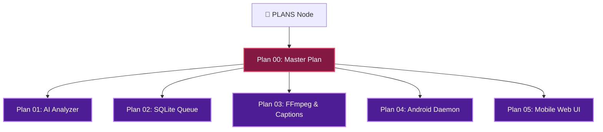

# 🚀 PLAN 00: MASTER SYSTEM ARCHITECTURE PLAN

> [!ABSTRACT] **Executive Summary**
> Master blueprint for the **Autonomous ClipIt System**. Designed to run continuously as a background process on mobile devices (Android / Termux), ingesting long-form videos, transcribing via cloud APIs, extracting viral moments via LLMs, cropping 9:16 vertical video via local FFmpeg, and rendering animated captions.

---

## 🎯 Central Hub Connection
- 🎯 **[[PLANS| Back to Central PLANS Node]]**

---

## 🗺️ Modular Plan Network

---

## 📋 Inner-Plan Navigation Matrix

| Plan Note | Focus Area | Detailed Specs |
| :--- | :--- | :--- |
| [[01-AI-Analyzer-Prompt-Engineering-Plan| 🧠 Plan 01]] | **AI Analyzer Engine** | Prompt engineering, hook scoring (0-10), transcript chunking |
| [[02-SQLite-Queue-State-Machine-Plan| 🗄️ Plan 02]] | **Database & Job Queue** | SQLite schemas, state transitions, crash recovery logic |
| [[03-FFmpeg-Vertical-Crop-And-Captioning-Plan| 🎬 Plan 03]] | **FFmpeg & Captions** | 9:16 vertical crop filter, ASS subtitle word highlight rules |
| [[04-Android-Termux-Daemon-Plan| 📱 Plan 04]] | **Android Background Daemon** | Wake-locks, battery-friendly sleep cycles, daemon start scripts |
| [[05-Local-Web-Review-UI-Plan| 💻 Plan 05]] | **Mobile Review Web UI** | FastAPI/Flask localhost web server for clip approval |

---

## 🛡️ Core Reliability Guarantees
> [!SUCCESS] **Crash & Reboot Recovery**: State transitions are saved transactionally in SQLite after every module finishes. Interruptions auto-resume from the last successful step.
> [!TIP] **Low Mobile Resource Footprint**: Local device handles media cropping & review UI; heavy AI models execute over lightweight cloud APIs.

---

## 🏷️ Plan Tags
#plan/master #plan/architecture #plan/isolated
