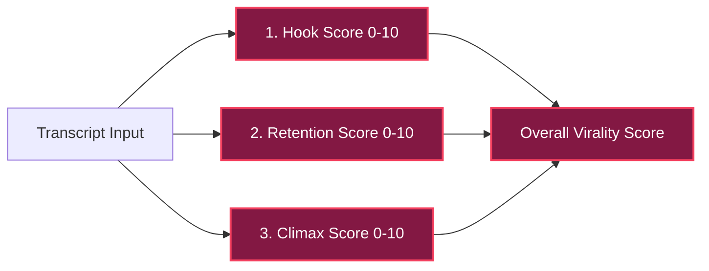

# 🧠 PLAN 01: AI ANALYZER & PROMPT ENGINEERING

> [!ABSTRACT] **Module Objective**
> Design the prompt engineering system, transcript chunking strategy, virality scoring model (0-10), and JSON output schema for the **LLM Content Analyzer**.

---

## 🎯 Central Hub Connection
- 🎯 **[[PLANS| Back to Central PLANS Node]]**

---

## 🎯 Scoring Criteria & Virality Formula



1. **Hook Score (Weight: 35%)**: Does the clip start with a compelling question, bold statement, or high-curiosity phrase within the first 3 seconds?
2. **Retention Value (Weight: 40%)**: Does the story/explanation deliver dense value without filler or dead silence?
3. **Climax & Punchline (Weight: 25%)**: Does the moment conclude cleanly within 15–60 seconds without feeling abruptly cut off?

---

## 📋 Standardized JSON Output Schema

```json
{
  "candidate_clips": [
    {
      "clip_id": 1,
      "start_timestamp": "00:02:14.500",
      "end_timestamp": "00:02:49.200",
      "duration_seconds": 34.7,
      "virality_score": 9.2,
      "hook_text": "This simple setting cuts render times in half...",
      "rationale": "Strong opening hook, clear actionable tutorial step, clean resolution.",
      "suggested_title": "Stop Rendering Slowly in FFmpeg 🚀",
      "suggested_hashtags": ["#ffmpeg", "#videoediting", "#techhacks"]
    }
  ]
}
```

---

## 🧠 System Prompt Template

> [!IMPORTANT] **LLM System Prompt Structure**
> You are an expert short-form video editor specializing in YouTube Shorts, TikTok, and Instagram Reels. Your task is to analyze timestamped transcript data and extract 15-60 second standalone clips with high retention and viral potential. Return strictly valid JSON adhering to the target schema.

---

## 🔗 Plan Connections
- 🎯 **[[PLANS| Central PLANS Hub]]**
- [[00-Master-System-Plan| 🚀 Master System Plan]]
- [[02-SQLite-Queue-State-Machine-Plan| 🗄️ Plan 02: SQLite Queue]]
- [[03-FFmpeg-Vertical-Crop-And-Captioning-Plan| 🎬 Plan 03: FFmpeg Crop]]

#plan/analyzer #plan/isolated
