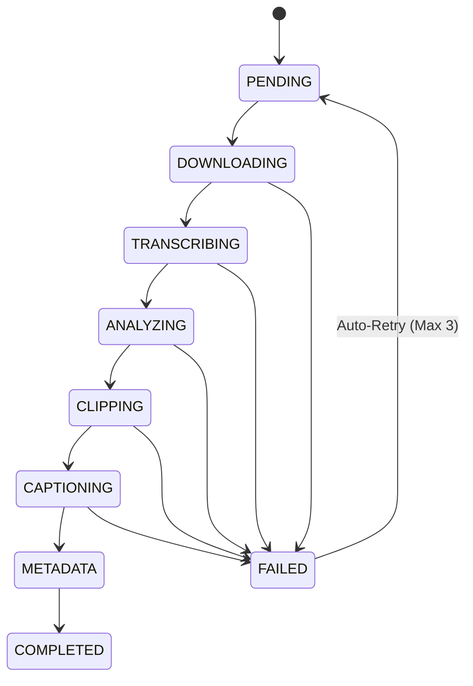

# 🗄️ PLAN 02: SQLITE QUEUE & STATE MACHINE

> [!ABSTRACT] **Module Objective**
> Design the database schema (`jobs`, `clips`, `logs`, `settings`), transactional state engine, and crash recovery mechanisms.

---

## 🎯 Central Hub Connection
- 🎯 **[[PLANS| Back to Central PLANS Node]]**

---

## 🔄 State Machine Lifecycle



---

## 🗄️ Database Schemas

### `jobs` Table
```sql
CREATE TABLE IF NOT EXISTS jobs (
    id TEXT PRIMARY KEY,
    source_url TEXT NOT NULL,
    source_type TEXT NOT NULL, -- 'youtube', 'local_file'
    title TEXT,
    duration_seconds REAL,
    status TEXT NOT NULL DEFAULT 'PENDING',
    raw_video_path TEXT,
    audio_path TEXT,
    transcript_json TEXT,
    retry_count INTEGER DEFAULT 0,
    created_at TIMESTAMP DEFAULT CURRENT_TIMESTAMP,
    updated_at TIMESTAMP DEFAULT CURRENT_TIMESTAMP
);
```

### `clips` Table
```sql
CREATE TABLE IF NOT EXISTS clips (
    id TEXT PRIMARY KEY,
    job_id TEXT NOT NULL,
    start_time TEXT NOT NULL,
    end_time TEXT NOT NULL,
    virality_score REAL,
    hook_text TEXT,
    video_path TEXT,
    caption_path TEXT,
    title TEXT,
    description TEXT,
    hashtags TEXT,
    approved INTEGER DEFAULT 0, -- 0: Pending, 1: Approved, 2: Rejected
    FOREIGN KEY(job_id) REFERENCES jobs(id) ON DELETE CASCADE
);
```

---

## 🛡️ Crash & Reboot Recovery Logic
> [!SUCCESS] **Atomic Transactions**
> 1. When the background daemon launches, it queries `SELECT * FROM jobs WHERE status NOT IN ('COMPLETED', 'FAILED')`.
> 2. If a job was interrupted while `TRANSCRIBING`, the daemon inspects `raw_video_path`. If raw video exists locally, it skips downloading and jumps straight to API transcription.
> 3. Each stage update is wrapped in a `BEGIN IMMEDIATE TRANSACTION` block.

---

## 🔗 Plan Connections
- 🎯 **[[PLANS| Central PLANS Hub]]**
- [[00-Master-System-Plan| 🚀 Master System Plan]]
- [[01-AI-Analyzer-Prompt-Engineering-Plan| 🧠 Plan 01: AI Analyzer]]
- [[04-Android-Termux-Daemon-Plan| 📱 Plan 04: Android Daemon]]

#plan/queue #plan/isolated
