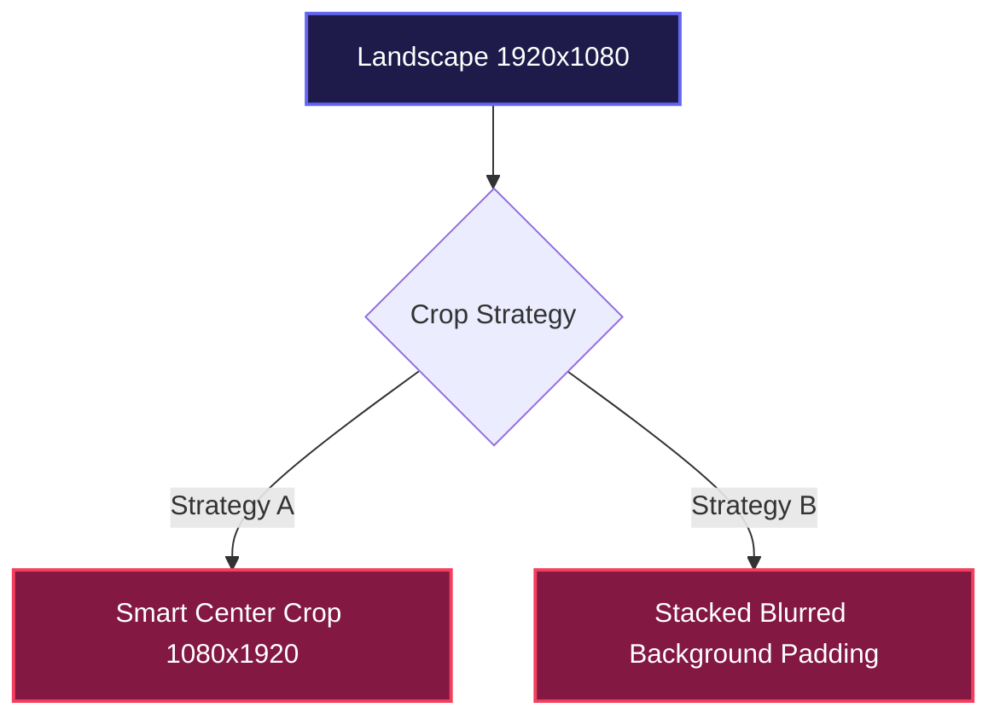

# 🎬 PLAN 03: FFMPEG VERTICAL CROP & CAPTIONING

> [!ABSTRACT] **Module Objective**
> Design the local video rendering engine for cutting 16:9 landscape footage into 9:16 vertical shorts (`1080x1920`) and burning stylized ASS subtitles with word-level highlight colors.

---

## 🎯 Central Hub Connection
- 🎯 **[[PLANS| Back to Central PLANS Node]]**

---

## 📐 16:9 to 9:16 Vertical Cropping Strategy



### Strategy A: Center Crop Filter Formula
```bash
ffmpeg -ss {start_time} -i input.mp4 -to {end_time} \
  -vf "crop=ih*(9/16):ih" \
  -c:v libx264 -preset fast -crf 22 -c:a copy vertical_clip.mp4
```

### Strategy B: Blurred Stack Padding Filter Formula
```bash
ffmpeg -i input.mp4 -filter_complex \
  "[0:v]scale=1080:1920:force_original_aspect_ratio=increase,boxblur=20:5,crop=1080:1920[bg]; \
   [0:v]scale=1080:-1[fg]; \
   [bg][fg]overlay=(main_w-overlay_w)/2:(main_h-overlay_h)/2" \
  -c:v libx264 -crf 22 -c:a copy blurred_clip.mp4
```

---

## 💬 ASS Subtitle Style Preset Spec

> [!IMPORTANT] **Word Highlight Styling**
> Advanced SubStation Alpha (ASS) allows high-contrast typography and word-by-word active color highlights.

```ini
[Script Info]
ScriptType: v4.00+
PlayResX: 1080
PlayResY: 1920

[V4+ Styles]
Format: Name, Fontname, Fontsize, PrimaryColour, SecondaryColour, OutlineColour, BackColour, Bold, Italic, Alignment, MarginL, MarginR, MarginV
Style: Default, Montserrat ExtraBold, 64, &H00FFFFFF, &H0000FFFF, &H00000000, &H80000000, 1, 0, 2, 80, 80, 480

[Events]
Format: Layer, Start, End, Style, Name, MarginL, MarginR, MarginV, Effect, Text
Dialogue: 0,0:00:12.40,0:00:14.20,Default,,0,0,0,,This {\c&H00FFFF&}trick{\c&HFFFFFF&} changed video editing!
```

---

## 🔗 Plan Connections
- 🎯 **[[PLANS| Central PLANS Hub]]**
- [[00-Master-System-Plan| 🚀 Master System Plan]]
- [[01-AI-Analyzer-Prompt-Engineering-Plan| 🧠 Plan 01: AI Analyzer]]
- [[05-Local-Web-Review-UI-Plan| 💻 Plan 05: Web Review UI]]

#plan/ffmpeg #plan/isolated
