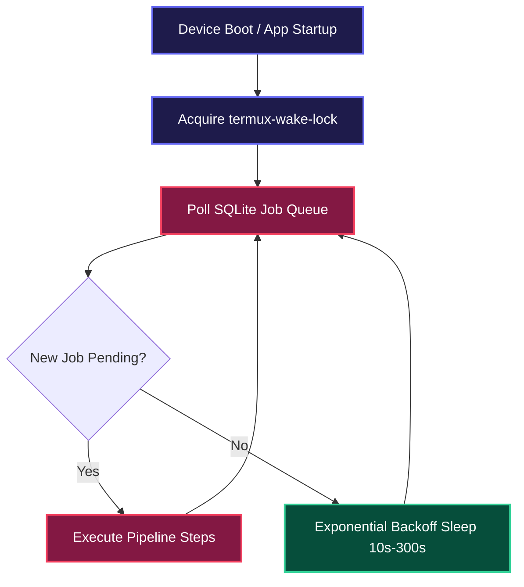

# 📱 PLAN 04: ANDROID TERMUX BACKGROUND DAEMON

> [!ABSTRACT] **Module Objective**
> Design the background daemon loop, power optimization strategies, battery-friendly sleep cycles, wake-lock acquisition, and automatic boot recovery scripts on Android.

---

## 🎯 Central Hub Connection
- 🎯 **[[PLANS| Back to Central PLANS Node]]**

---

## ⚡ Android Background Execution Architecture



---

## 🔋 Power Management & Battery Protection Rules

> [!TIP] **1. Wake-Lock Management (`termux-wake-lock`)**
> Prevents the Android CPU from entering deep sleep while rendering videos or transcribing audio.

> [!IMPORTANT] **2. Exponential Backoff Polling**
> - When queue is empty: Initial check at 10s -> 30s -> 60s -> Max 300s (5 min).
> - When new job arrives: Instantly resets sleep timer back to 0s.

> [!CAUTION] **3. Battery & Thermal Safeguards**
> - Pause heavy FFmpeg rendering if phone battery drops below 15%.
> - Pause processing if CPU thermal throttling threshold is triggered.

---

## 📄 Startup Launcher Script (`start.sh`)

```bash
#!/data/data/com.termux/files/usr/bin/bash

echo "🚀 Starting ClipIt System Daemon..."

# Acquire Android Wake Lock
termux-wake-lock

# Activate Python Environment & Run Daemon
export PYTHONUNBUFFERED=1
python3 main.py --daemon >> storage/logs/daemon.log 2>&1 &

echo "✅ Daemon started in background. Logs: storage/logs/daemon.log"
```

---

## 🔗 Plan Connections
- 🎯 **[[PLANS| Central PLANS Hub]]**
- [[00-Master-System-Plan| 🚀 Master System Plan]]
- [[02-SQLite-Queue-State-Machine-Plan| 🗄️ Plan 02: SQLite Queue]]

#plan/daemon #plan/isolated
