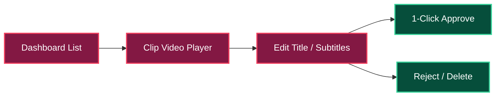

# 💻 PLAN 05: LOCAL MOBILE WEB REVIEW UI

> [!ABSTRACT] **Module Objective**
> Design the lightweight, mobile-friendly FastAPI / Flask web dashboard accessible at `http://localhost:8000` on the phone's browser for reviewing, editing, approving, or rejecting generated vertical clips.

---

## 🎯 Central Hub Connection
- 🎯 **[[PLANS| Back to Central PLANS Node]]**

---

## 📱 Review Interface Flow



---

## 🎨 UI Feature Specifications

1. **Clip Feed Card View**: Shows generated vertical clip thumbnails, virality score badge (`9.2/10`), hook text, and duration (`34s`).
2. **Embedded HTML5 Video Player**: Plays vertical 9:16 `.mp4` video with rendered subtitles.
3. **One-Click Approval**: Single tap to approve clip for export/publishing queue.
4. **Quick Editor Modal**: Allows instant tweaking of clip title, description, or subtitle text before final approval.

---

## ⚡ API Endpoint Structure (`ui/app.py`)

```python
# GET  /                     -> Render Mobile Dashboard HTML
# GET  /api/clips/pending   -> Fetch JSON list of pending clips
# POST /api/clips/{id}/approve -> Mark clip as approved
# POST /api/clips/{id}/reject  -> Mark clip as rejected/deleted
# POST /api/clips/{id}/update  -> Update title, description, or ASS text
```

---

## 🔗 Plan Connections
- 🎯 **[[PLANS| Central PLANS Hub]]**
- [[00-Master-System-Plan| 🚀 Master System Plan]]
- [[03-FFmpeg-Vertical-Crop-And-Captioning-Plan| 🎬 Plan 03: FFmpeg Crop]]

#plan/ui #plan/isolated
