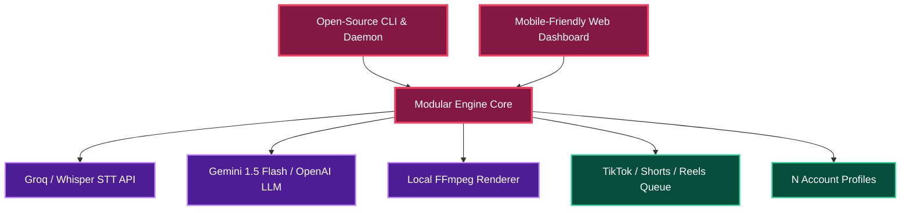

# 🔓 PLAN 07: OPEN-SOURCE SELF-HOSTED AI CLIPPING ENGINE (OPEN-WEPLOD)

> [!ABSTRACT] **Mission Statement**
> Build the world's premiere **open-source, self-hosted alternative to Weplod, OpusClip, and Klap**. Anyone can run this engine on their phone (Termux), local PC, or a $5/mo VPS to monitor YouTube channels, generate viral 9:16 vertical clips with AI subtitles, and manage N social media accounts for free.

---

## 🎯 Central Hub Connection
- 🎯 **[[PLANS| Back to Central PLANS Node]]**

---

## 🗺️ Open-Source Ecosystem Architecture

---

## 🚀 Key Open-Source Selling Points

| Metric | Commercial SaaS (Weplod/Opus) | Open-Source Self-Hosted Engine |
| :--- | :--- | :--- |
| **Pricing** | $20 – $99 / month | **$0 / month** (+ cents per hr for API) |
| **Channel Limit** | 1 – 5 Channels | **Unlimited Channels (N Accounts)** |
| **Data Privacy** | Stored on 3rd party cloud | **100% Local / Self-Hosted** |
| **Customization** | Rigid SaaS templates | **Custom ASS fonts, crop math, LLM prompts** |
| **Deployment** | Closed web app | **Termux, Docker, Linux VPS, Windows/Mac** |

---

## 🏗️ Technical Stack & License Blueprint

- **License**: MIT License (Permissive, Developer-Friendly).
- **Core Engine**: Python 3.11+, SQLite, FFmpeg, `yt-dlp`.
- **Frontend Dashboard**: Lightweight Web Dashboard (FastAPI + TailwindCSS).
- **Deployment Target**:
  - `start.sh` for Android Termux.
  - `docker-compose.yml` for VPS / Home Server deployment.

---

## 🔗 Plan Connections
- 🎯 **[[PLANS| Central PLANS Hub]]**
- [[00-Master-System-Plan| 🚀 Plan 00: Master Architecture]]
- [[06-Multi-Account-N-Scaling-Plan| 🌐 Plan 06: N-Account Engine]]

#plan/opensource #plan/weplod #plan/isolated
