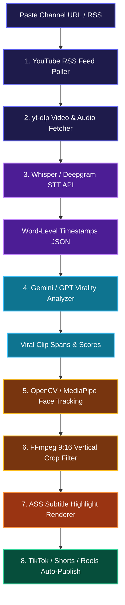

# 🔬 PLAN 08: WEPLOD UNDER-THE-HOOD REVERSE ENGINEERING SPEC

> [!ABSTRACT] **Executive Summary**
> Comprehensive reverse-engineering specification documenting how commercial platforms like Weplod.io, OpusClip, and Klap operate under the hood—covering ingestion, speech-to-text, AI virality scoring, computer-vision face tracking, subtitle rendering, and API publishing.

---

## 🎯 Central Hub Connection
- 🎯 **[[PLANS| Back to Central PLANS Node]]**

---

## 🗺️ Complete System Architecture Flow



---

## 🛠️ Step-by-Step Technical Deep Dive

### 1. 📡 Ingestion & Channel Monitoring (The Watcher)
- **Mechanism**: Monitors YouTube channel RSS feeds (`youtube.com/feeds/videos.xml?channel_id=...`).
- **Poller**: Background task checks XML feed every 10–15 minutes.
- **De-duplication**: Stores seen video IDs in a database to avoid duplicate processing.

---

### 2. 📥 Media Acquisition & Extraction (The Fetcher)
- **Tooling**: `yt-dlp` CLI / Python wrapper + `ffmpeg`.
- **Process**: Downloads raw `.mp4` video and extracts a light `.wav` audio track for transcription.
- **Storage**: Temporary buffer storage (Cloudflare R2 / local disk).

---

### 3. 🎙️ Speech-to-Text & Word Timestamps (The Transcriber)
- **Engine**: OpenAI Whisper API, Deepgram, or Groq LPU Whisper.
- **Data Payload**: Returns word-level start/end timing arrays:
```json
[
  {"word": "This", "start": 12.10, "end": 12.30},
  {"word": "crazy", "start": 12.31, "end": 12.60},
  {"word": "hack", "start": 12.61, "end": 12.95}
]
```

---

### 4. 🧠 AI Virality Scoring & Moment Detection (The Analyzer)
- **Engine**: LLMs (Gemini 1.5 Flash, GPT-4o).
- **Prompt Strategy**: Analyzes transcript chunks to evaluate:
  1. **Hook Quality (0–10)**: Strong curiosity gap in the first 3 seconds.
  2. **Retention Value (0–10)**: High density of actionable or entertaining info.
  3. **Punchline / Climax**: Clean ending within 15–60 seconds.

---

### 5. 👁️ Computer Vision Face Tracking (The Clipper)
- **Algorithm**: OpenCV / MediaPipe / YOLO face detection.
- **Cropping Logic**: Tracks active speaker coordinates `(x, y)` across frames and centers a dynamic 9:16 crop window (`1080x1920`). If two speakers talk, it generates a top/bottom split screen.

---

### 6. 💬 Animated Subtitle Burn-In (The Captioner)
- **Format**: Advanced SubStation Alpha (`.ass`).
- **Styling Rules**: Applies bold typography, stroke outlines, and active word color highlights (`{\c&H00FFFF&}`).
- **Rendering**: FFmpeg burns captions directly onto the video stream:
```bash
ffmpeg -i clip.mp4 -vf "subtitles=captions.ass" final_clip.mp4
```

---

### 7. 🚀 Social Media Auto-Publishing (The Publisher)
- **Integrations**:
  - **TikTok**: Content Posting API
  - **YouTube Shorts**: YouTube Data API v3 (`videos.insert`)
  - **Instagram Reels**: Meta Graph API (`media` & `media_publish`)

---

## 🔗 Related Plans
- 🎯 **[[PLANS| Central PLANS Hub]]**
- [[00-Master-System-Plan| 🚀 Plan 00: Master System Plan]]
- [[07-Open-Source-Weplod-Clone-Plan| 🔓 Plan 07: Open-Source Weplod Engine]]

#plan/weplod #plan/reverse engineering #plan/isolated
