# 🎯 PLANS — MASTER PLANNING HUB

> [!ABSTRACT] 🌟 **Central Planning Star Network**
> The master hub for all technical implementation plans, architectural blueprints, and engineering roadmaps for the **ClipIt System**. Connected directly to **[[AGENTS]]**.

---

## 🗺️ Master Plan Star Topology

```mermaid
flowchart TD
    classDef hub fill:#831843,stroke:#f43f5e,stroke-width:3px,color:#fff
    classDef agent fill:#9a3412,stroke:#fb923c,stroke-width:3px,color:#fff
    classDef p00 fill:#4c1d95,stroke:#c084fc,stroke-width:2px,color:#fff
    classDef p01 fill:#064e3b,stroke:#34d399,stroke-width:2px,color:#fff
    classDef p02 fill:#0e7490,stroke:#38bdf8,stroke-width:2px,color:#fff
    classDef p03 fill:#78350f,stroke:#fbbf24,stroke-width:2px,color:#fff
    classDef p04 fill:#9a3412,stroke:#fb923c,stroke-width:2px,color:#fff
    classDef p05 fill:#1e3a8a,stroke:#60a5fa,stroke-width:2px,color:#fff
    classDef p06 fill:#701a75,stroke:#f0abfc,stroke-width:2px,color:#fff
    classDef p07 fill:#047857,stroke:#34d399,stroke-width:2px,color:#fff
    classDef p08 fill:#be123c,stroke:#fda4af,stroke-width:2px,color:#fff

    PLANS[🎯 Central PLANS Node]:::hub <--> AGENTS[🤖 Central AGENTS Node]:::agent

    PLANS --> P00[🚀 Plan 00: Master Architecture Plan]:::p00
    PLANS --> P01[🧠 Plan 01: AI Analyzer & Prompts]:::p01
    PLANS --> P02[🗄️ Plan 02: SQLite Queue & State Machine]:::p02
    PLANS --> P03[🎬 Plan 03: FFmpeg Crop & Subtitles]:::p03
    PLANS --> P04[📱 Plan 04: Android Background Daemon]:::p04
    PLANS --> P05[💻 Plan 05: Mobile Web Review UI]:::p05
    PLANS --> P06[🌐 Plan 06: N-Account Scaling Engine]:::p06
    PLANS --> P07[🔓 Plan 07: Open-Source Weplod Clone Engine]:::p07
    PLANS --> P08[🔬 Plan 08: Weplod Reverse Engineering Spec]:::p08
```

---

## 📂 System Plans Inventory & Color Matrix

> [!IMPORTANT] **Click any plan below to inspect its detailed engineering blueprint:**

| Plan Badge | Plan Title | Focus Area | Color Theme in Graph |
| :---: | :--- | :--- | :---: |
| 💖 **HUB** | [[PLANS| 🎯 Central PLANS Hub]] | Master Planning Node | `💖 NEON PINK` |
| 🤖 **AGENTS** | [[AGENTS| 🤖 Central AGENTS Hub]] | Master Agent Division Node | `🍊 ELECTRIC ORANGE` |
| 🚀 **PLAN 00** | [[00-Master-System-Plan| 🚀 Plan 00: Master Architecture]] | End-to-end Pipeline & Recovery | `🟣 VIOLET` |
| 🧠 **PLAN 01** | [[01-AI-Analyzer-Prompt-Engineering-Plan| 🧠 Plan 01: AI Analyzer Engine]] | Prompt Engineering & Scoring | `🟢 EMERALD` |
| 🗄️ **PLAN 02** | [[02-SQLite-Queue-State-Machine-Plan| 🗄️ Plan 02: SQLite Queue]] | Schemas & State Machine | `🔷 SKY BLUE` |
| 🎬 **PLAN 03** | [[03-FFmpeg-Vertical-Crop-And-Captioning-Plan| 🎬 Plan 03: FFmpeg & Captions]] | 9:16 Crop & ASS Subtitles | `🟡 GOLD` |
| 📱 **PLAN 04** | [[04-Android-Termux-Daemon-Plan| 📱 Plan 04: Android Daemon]] | Wake-locks & Battery Management | `🟠 CORAL` |
| 💻 **PLAN 05** | [[05-Local-Web-Review-UI-Plan| 💻 Plan 05: Mobile Web UI]] | Localhost Review Dashboard | `🔵 ELECTRIC BLUE` |
| 🌐 **PLAN 06** | [[06-Multi-Account-N-Scaling-Plan| 🌐 Plan 06: N-Account Scaling Engine]] | Multi-Tenant Architecture (N Accounts) | `🟪 MAGENTA PURPLE` |
| 🔓 **PLAN 07** | [[07-Open-Source-Weplod-Clone-Plan| 🔓 Plan 07: Open-Source Weplod Clone]] | Open-Source Self-Hosted Suite | `🟢 LIME EMERALD` |
| 🔬 **PLAN 08** | [[08-Weplod-Under-The-Hood-Reverse-Engineering-Plan| 🔬 Plan 08: Weplod Reverse Engineering Spec]] | Complete Technical Breakdown | `🔴 CRIMSON ROSE` |

---

## 🏷️ Planning Tags
#plan/hub #plan/master #plan/analyzer #plan/queue #plan/ffmpeg #plan/daemon #plan/ui #plan/multiaccount #plan/opensource #plan/reverse engineering
